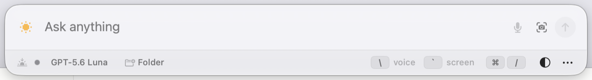
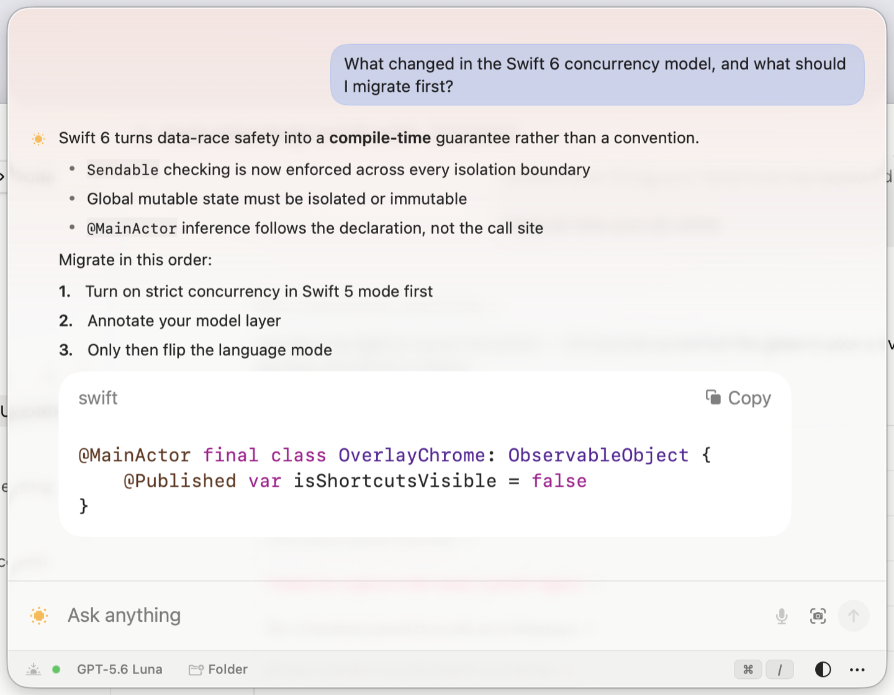
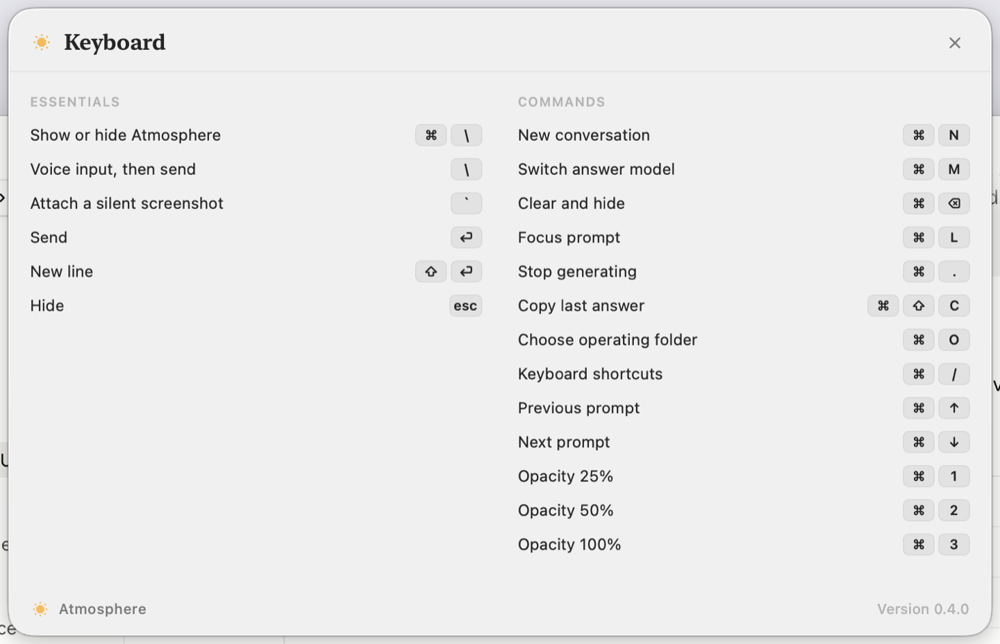

<p align="center">
  
</p>

<h1 align="center">Atmosphere</h1>

<p align="center">
  A keyboard-first assistant overlay for macOS.<br>
  Press <code>⌘\</code> anywhere, ask, get a streamed answer. Never touch the mouse.
</p>

<p align="center">
  <a href="https://github.com/unlikefraction/atmosphere/releases/latest">
    
  </a>
</p>

<p align="center">
  
</p>

## What it is

Atmosphere is one line of glass that floats over whatever you are doing. It has
no Dock icon, no menu-bar item, and no window to manage. `⌘\` brings it up on
top of every app and every Space — including full-screen ones — and `Esc` puts
it away.

**It is built to be fast enough that you never plan around it.** Ask a question
mid-sentence, get the answer, dismiss it, keep working. The panel is a single
prompt bar until there is something to show; then it opens upward into a
conversation, so the prompt never moves out from under your cursor.

**Your hands never leave the keyboard.** Typing, dictating, and screenshotting
are all one keystroke each, and they compose:

- **Type** — just type. `Return` sends, `⇧Return` adds a line.
- **Speak** — `\` starts recording, `\` again transcribes and sends. English,
  Hindi, Hinglish, and Urdu are all tried automatically.
- **Show** — `` ` `` silently captures the screen behind the panel and attaches
  it. No shutter sound, no flash, and Atmosphere excludes itself from the shot.

Press `` ` `` to grab the error you are looking at, then `\` and say "why is
this happening?", and both go up together as one message — without ever
reaching for the trackpad.

<p align="center">
  
</p>

## Two answer models

`⌘M` switches between them; the footer names the one in use.

| Model | Runs through |
| --- | --- |
| **GPT‑5.6 Luna** · medium reasoning | the Codex app server bundled with the ChatGPT app |
| **Claude Opus 5** · light thinking | the Claude Code CLI |

Both are local, first-party command-line tools that you are **already signed in
to**. Atmosphere never asks for an API key, never stores a token, and never
touches your credentials — it starts the tool you already have and reads its
output.

Point it at a folder and either model can read files in it — read-only, always.
Neither can write, delete, or run commands.

<p align="center">
  
</p>

## Install

1. **[Download the latest release](https://github.com/unlikefraction/atmosphere/releases/latest)**
   and unzip it.
2. Drag `Atmosphere.app` to `/Applications`.
3. **The first launch needs a right-click.** Right-click (or Control-click) the
   app and choose **Open**, then **Open** again in the dialog. A normal
   double-click will be blocked — see below for why.
4. Press `⌘\`. The overlay appears.

### Why macOS complains, and what to do

The app is **ad-hoc signed**, not signed with a paid Apple Developer ID and not
notarized. That is the honest trade: no $99/year certificate, and macOS treats
it as unidentified software. It is the same binary the source in this repo
builds — you can verify that by building it yourself.

| What you see | What to do |
| --- | --- |
| *"Atmosphere" cannot be opened because Apple cannot check it for malicious software* | Right-click the app → **Open** → **Open**. Only needed once. |
| *"Atmosphere" is damaged and can't be opened* | The quarantine flag survived the unzip. Run: `xattr -dr com.apple.quarantine /Applications/Atmosphere.app` |
| Nothing happens when you open it | That is correct. Atmosphere has no Dock icon. Press `⌘\`. |
| `⌘\` does nothing | Another app owns that shortcut. Quit it and relaunch Atmosphere. |

### Permissions

Atmosphere asks for nothing until you use the feature that needs it.

- **Microphone** — only for `\` voice input. Granted on first use.
- **Screen Recording** — only for `` ` `` screenshots. macOS requires one
  restart after the first grant; the panel offers a **Restart** button that
  does it for you.

Both appear as orange chips in the footer when they are off, and clicking a
chip takes you straight to the right pane of System Settings.

## Requirements

- macOS 14 (Sonoma) or newer, Apple silicon or Intel
- At least one answer model:
  - **GPT‑5.6 Luna** — the [ChatGPT desktop app](https://openai.com/chatgpt/download/),
    signed in. Atmosphere uses the `codex` runtime inside it.
  - **Claude Opus 5** — the [Claude Code CLI](https://claude.com/claude-code),
    signed in (`claude` on your `PATH`).
- **Voice input is optional** and needs a [Deepgram](https://deepgram.com) API
  key in `~/.atmosphere/deepgram-api-key` — see [Deepgram voice setup](#deepgram-voice-setup).
  Everything else works without it.


## Shape and motion

Atmosphere is a single prompt line until it has something to show. Idle, it is
one Spotlight-height bar with a quiet footer. Ask a question and the panel
opens upward to its full height: answers above, prompt below, the way a
conversation reads. The bottom edge is the anchor, so the prompt never moves
out from under the cursor, and the height changes exactly once — never on every
streamed token.

The panel rises into place on show and fades on hide. While the model is
working, a highlight travels the mark's lit limb; the moment it stops, that
indicator is torn down rather than left spinning. Everything respects Reduce
Motion: with it on, states change without animating.

## The sky

The mark is whatever is in the sky right now: a crescent moon after dark, the
sun in daylight. Both are pixel art on a 13×13 grid — flat colour, hard edges,
no gradients and no glows. While the model is working the moon's stars twinkle
and the sun throws a second ring of beams; the instant it stops, that indicator
is torn down rather than left running.

Behind the conversation sits a thin flat tint of the same hour, with pixel
stars at night, and the matching phase glyph in the footer. It is deliberately
faint: an answer's contrast must not change because the clock did. The display
type is New York, the system serif.

## Keyboard

Press `⌘/` for the full sheet inside the app.

| Keys | Action |
| --- | --- |
| `⌘ \` | Show or hide Atmosphere (works from any app) |
| `\` | Voice input; press again to transcribe and send |
| `` ` `` | Attach a silent screenshot |
| `Return` | Send · `⇧Return` inserts a newline |
| `Esc` | Hide |
| `⌘M` | Switch answer model |
| `⌘N` | New conversation |
| `⌘⌫` | Clear and hide |
| `⌘L` | Focus the prompt and select it |
| `⌘.` | Stop generating |
| `⌘⇧C` | Copy the last answer |
| `⌘↑` / `⌘↓` | Walk back and forward through sent prompts |
| `⌘O` | Choose the operating folder |
| `⌘/` | Keyboard shortcuts |
| `⌘1` `⌘2` `⌘3` | Panel opacity 25%, 50%, 100% |

Prompt history persists across launches and is capped; stepping back from the
newest entry restores whatever draft was in progress, so browsing history never
eats unsent text. Editing the prompt leaves history and returns to the draft.

These are panel-scoped: they are handled only while Atmosphere is visible and
never install global listeners beyond the `⌘ \` hot key. `⌘C`, `⌘V`, `⌘A`,
`⌘Z` and friends stay with the text system.

Screenshots, typed text, and voice are composable. Screenshots remain pending,
typed text remains editable, and a finished voice transcript is appended to the
draft. Voice then submits that combined text plus every pending screenshot once;
if a screenshot is still being captured, submission waits for it. A screenshot
without voice is sent only when Return or the send button is used.

The two bare-key controls are local to a visible Atmosphere panel; they do not
install global key listeners. While the panel is visible, bare `\\` and
backtick are reserved and consumed instead of being inserted into the composer.
See [voice, screenshot, nesting, and private-file behavior](Docs/Voice-and-Screenshot.md).

The footer is the panel's only chrome: connection state, answer model, and the
operating folder, all at caption scale. Permission chips appear there **only
when something needs attention**. An orange `Mic off` or `Screen off` chip is a
button: it requests first-use access when possible, otherwise opens
Atmosphere's exact pane under System Settings → Privacy & Security. Atmosphere
refreshes both indicators when the overlay opens and when the app becomes
active. After the first Screen Recording grant, a `Restart for Screen` chip
cleanly quits and reopens Atmosphere so the new permission takes effect.

Choose a folder to let Atmosphere inspect it read-only when a question needs
local context. Click the folder chip again to replace it, use its clear button
to remove it, or right-click to reveal it in Finder. The selection persists
across conversations and app launches.

The footer also carries 25%, 50%, and 100% opacity choices — by menu or
`⌘1`/`⌘2`/`⌘3` — so the desktop can remain visible underneath the entire
overlay.

In the composer, Return sends the message and Shift-Return inserts a newline.
Long pasted text keeps the insertion point visible as the composer scrolls.

Drag the overlay from its background to place it where you want. Atmosphere
restores that position after hiding, showing, or relaunching. If the saved
position belongs to a disconnected display, it safely returns to the active
screen instead of remaining off-screen.

Assistant progress appears as a compact live activity line until answer text
arrives. Streaming and completed assistant text is rendered as native,
selectable Markdown, including headings, lists, tables, links, and code blocks.
User text remains literal, and Copy preserves the original Markdown.

## Deepgram voice setup

The API key is read from `~/.atmosphere/deepgram-api-key`; Atmosphere never puts
it in source code, preferences, the app bundle, or macOS Keychain. Provision or
replace it through a hidden prompt:

```bash
(
  set -euo pipefail
  atmosphere_credential_dir="$HOME/.atmosphere"
  atmosphere_credential_tmp=""
  trap '[[ -z "$atmosphere_credential_tmp" || ! -e "$atmosphere_credential_tmp" ]] || rm -- "$atmosphere_credential_tmp"' EXIT HUP INT TERM
  umask 077
  mkdir -p "$atmosphere_credential_dir"
  chmod -N "$atmosphere_credential_dir"
  chmod 700 "$atmosphere_credential_dir"
  read -s "atmosphere_deepgram_key?Deepgram API key: "
  printf '\n'
  [[ -n "${atmosphere_deepgram_key//[[:space:]]/}" ]] || {
    printf 'The key cannot be empty.\n' >&2
    exit 1
  }
  atmosphere_credential_tmp="$(mktemp "$atmosphere_credential_dir/.deepgram-api-key.XXXXXX")"
  printf '%s\n' "$atmosphere_deepgram_key" > "$atmosphere_credential_tmp"
  chmod -N "$atmosphere_credential_tmp"
  chmod 600 "$atmosphere_credential_tmp"
  mv -f "$atmosphere_credential_tmp" "$atmosphere_credential_dir/deepgram-api-key"
  atmosphere_credential_tmp=""
  unset atmosphere_deepgram_key
)
```

The file is intentionally plain text so rebuilds never trigger Keychain access
prompts. Atmosphere requires mode `0700` on the directory, mode `0600` on the
file, a regular non-symlink file, and ownership by the current account. The
setup above also clears extended ACLs. These restrictions protect normal local
account separation, but they do not protect the key from processes already
running as you or from backups with access to your files.

For every completed recording, Atmosphere tries Deepgram in this order:
English, Hindi, Nova-3 English/Hindi code-switching (Hinglish), then Urdu. The
first confident, script-compatible transcript is submitted. If every attempt is
empty or unreliable, Atmosphere reports that no text was detected.

## Switching models

`⌘M` moves between the two engines: `codex app-server` over a private stdio
pipe, and `claude --print` in streaming-input mode.

A conversation belongs to one engine. Switching ends the current thread, starts
the other engine, and clears the transcript — leaving the answers on screen
would imply the new model can see them, and it cannot. The choice persists
across launches.

## Claude connection

Atmosphere runs one long-lived `claude --print` process per conversation, not
one per turn: a cold start costs over a second, and paying that on every
question would undo the point of a keyboard-first overlay. Messages go in as
newline-delimited JSON, events come back the same way, and the session keeps
its context between turns.

The session is launched with `--model claude-opus-5 --effort low`,
`--dangerously-skip-permissions`, and `--tools Read,Grep,Glob`. Those last two
belong together: because nothing will stop to ask, the tool list — not a
prompt — is what keeps an answer from touching the machine. There is no Bash,
no Write, no Edit. `--strict-mcp-config` with no config file keeps the user's
MCP servers, plugins, and their tools out of a session that only has to answer
a question. The process runs in the selected operating folder, or in a private
application-support directory when none is chosen.

Only generic activity is surfaced — that a tool ran, never which one, with what
arguments, or what it returned — matching the Codex path. Interrupting a turn
restarts the process with `--resume`, since the CLI cannot abandon an in-flight
turn without abandoning the process.

Executable discovery prefers the `AtmosphereClaudeExecutablePath` user-default
override, then `claude` on `PATH`, then the usual install locations. A
Finder-launched app inherits a minimal `PATH`, which is why the fallbacks exist.

## ChatGPT connection

Atmosphere launches its own instance of the official `codex app-server` over a
private standard-input/output pipe. It does not attach to the desktop app's
private process or scrape ChatGPT cookies.

Executable discovery prefers:

1. the `AtmosphereCodexExecutablePath` user-default override;
2. the Codex runtime included at
   `/Applications/ChatGPT.app/Contents/Resources/codex`;
3. `codex` on `PATH`; and
4. common Homebrew/local installation paths.

The app server reuses Codex-managed ChatGPT authentication when available. If
sign-in is needed, Atmosphere opens the documented managed ChatGPT OAuth flow;
it never reads or stores the resulting access token itself. Conversations are
ephemeral, pin `gpt-5.6-luna` with medium reasoning effort, and use a read-only,
no-approval thread. The thread works in the selected operating folder or, when
none is selected, a neutral private application-support directory. Atmosphere
shows only documented commentary, concise reasoning summaries, plans, and
generic tool activity; raw reasoning, command text, arguments, and tool output
are never exposed.

Atmosphere launches App Server with an isolated Codex home under
`~/.atmosphere/codex-home`. It links only the private ChatGPT authentication
file when one already exists; it does not inherit the normal Codex config,
plugins, MCP servers, hooks, or project-trust state. This prevents configured
Computer Use or browser helpers from starting while preserving read-only shell
inspection inside the selected operating folder.

This is the documented **Codex App Server**, not a generic API for controlling
the consumer ChatGPT desktop UI. It is version-coupled and currently intended
for custom Codex clients. See [OpenAI integration details](Docs/OpenAI-Integration.md).

## Screen-capture privacy: important limitation

Atmosphere applies `NSWindow.sharingType = .none`, the same best-effort setting
exposed as Tauri `contentProtected` and used by Pluely. On the development Mac,
that excluded the panel from the Computer Use capture path during testing.

It is **not possible to guarantee that a visible macOS window will never appear
in every screen share or recording**. Apple now calls this sharing type legacy,
and Apple DTS states that macOS has no public API by which an ordinary app can
prevent capture. A full-display share, mirroring, privileged recorder, or a
camera can reveal the panel.

For private use, share a specific app/window rather than a whole display, and
hide Atmosphere before changing capture modes. Read the full
[capture privacy research and test matrix](Docs/Capture-Privacy.md).

Atmosphere's own backtick capture is a separate, cooperative ScreenCaptureKit
path: it explicitly excludes Atmosphere, hides the pointer, and does not play a
sound. The first use asks for Screen Recording access; after granting it, use
Atmosphere's `Restart Atmosphere` action once, as required by Apple's
first-grant behavior.

## Build from source

Requirements:

- macOS 14 or newer;
- Xcode 16 or newer (validated with Xcode 26.4.1); and
- [XcodeGen 2.45.4](https://github.com/yonaskolb/XcodeGen) when regenerating
  the checked-in project.

Build the checked-in project:

```bash
xcodebuild \
  -project Atmosphere.xcodeproj \
  -scheme Atmosphere \
  -configuration Debug \
  -destination 'platform=macOS' \
  -derivedDataPath .build \
  -skipMacroValidation \
  CODE_SIGNING_ALLOWED=NO \
  build
```

If `project.yml` changes, regenerate the project explicitly with XcodeGen
2.45.4, review the generated diff, and then build:

```bash
xcodegen generate
```

The release script intentionally does not regenerate the project based on
whether XcodeGen happens to be installed. This keeps a checkout's release input
deterministic.

Run tests:

```bash
xcodebuild test \
  -project Atmosphere.xcodeproj \
  -scheme Atmosphere \
  -destination 'platform=macOS' \
  -derivedDataPath .build \
  -skipMacroValidation \
  CODE_SIGNING_ALLOWED=NO
```

Create an ad-hoc-signed release artifact with:

```bash
./Scripts/build-release.sh
```

The script performs a fresh build, stages and verifies the signed candidate, and
only then replaces `dist/Atmosphere.app`. The result is ad-hoc signed for local
use; it is not a Developer ID-signed or notarized distribution.

To preserve the app's macOS microphone and Screen Recording privacy identity
across rebuilds, supply a stable signing identity installed on the Mac:

```bash
ATMOSPHERE_SIGNING_IDENTITY="Apple Development: Your Name (TEAMID)" \
  ./Scripts/build-release.sh
```

Use `security find-identity -v -p codesigning` to list available identities. If
`ATMOSPHERE_SIGNING_IDENTITY` is unset or empty, the script keeps the ad-hoc
fallback described above. Selecting an identity does not add Developer ID
distribution or notarization.

## Project layout

```text
Atmosphere/App            application lifecycle
Atmosphere/Overlay        floating NSPanel, placement, and content-driven sizing
Atmosphere/System         global ⌘ + \ hot key and panel-scoped key commands
Atmosphere/UI             design system, mark, and SwiftUI interface
Atmosphere/ViewModels     chat presentation state
Atmosphere/Services       App Server, Deepgram, microphone, screenshot, prompt history, private credentials
Atmosphere/Resources      generated app icon
AtmosphereTests           stream framing, protocol parsing, keyboard, geometry
Artwork                   icon source render
Docs                      integration and capture research
Scripts                   release and app-icon generation
```

## Design

Layout, motion, and colour tokens live in `Atmosphere/UI/DesignSystem.swift`;
the panel sizes itself arithmetically from those metrics rather than waiting for
a layout pass, which is what keeps show, grow, and collapse correct on the first
frame.

The app icon is the same pixel moon over flat night sky. The grid is generated
from circle tests rather than hand-plotted, so one radius change re-renders
cleanly at every size — the 15pt mark beside a message, the 56pt mark on the
connect screen, and all ten icon sizes.

Regenerate the icon after changing that geometry:

```bash
swift Scripts/generate-appicon.swift
```

It writes `Atmosphere/Resources/AppIcon.icns` and a 1024pt render to
`Artwork/appicon-1024.png`.

`--probe-claude "<prompt>"` runs one real turn against the Claude backend and
prints the events it produced. Process spawning, stream framing, and event
mapping cannot be covered by a unit test; this is how they are checked.

Debug builds can also be screenshotted — `--allow-capture` relaxes the panel's
best-effort capture exclusion for design work only, and is compiled out of
Release entirely.

Debug builds can capture every overlay state — compact, conversation, thinking,
listening, connect, shortcuts — in both appearances, without driving the live
app:

```bash
.build/Build/Products/Debug/Atmosphere.app/Contents/MacOS/Atmosphere \
  --render-overlay-previews /tmp/atmosphere-previews
```
